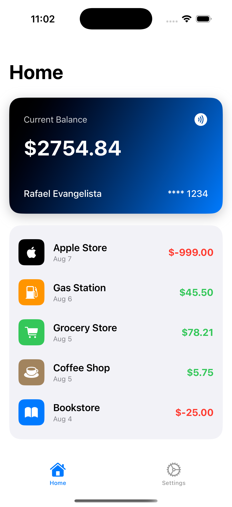
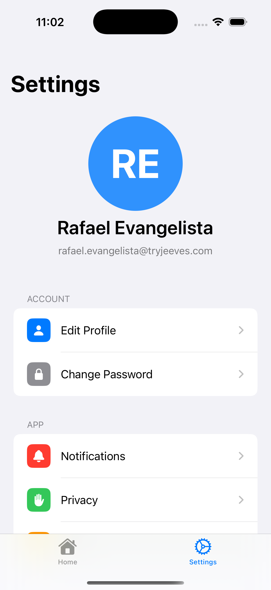

# 
## SwiftUI iOS App
### Screenshots
This is a simple iOS app, with two main screens:

## HomeView.swift

## SettingsView.swift

### In Settings, we have access to other screens:
 - Edit Profile
 - Change Password
 - Notifications
 - Privacy
 - Help